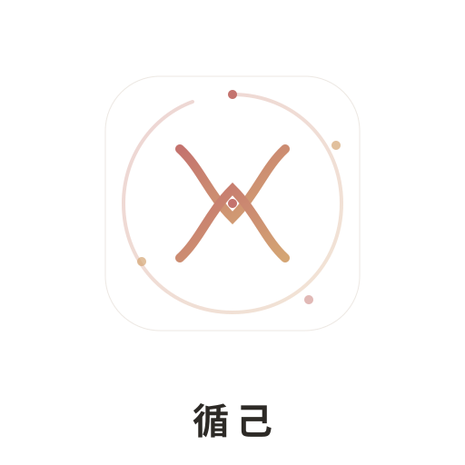

---

## 📜 商标与品牌声明

**循己 / XUNJI** 名称及 Logo 为陈令璇（christina412）所有的商标，未经书面授权，任何个人或组织不得将 "循己" "XUNJI" 名称、Logo 或其变体用于商业目的，包括但不限于：

- 以循己/XUNJI名义发布产品或服务
- 在应用商店、网站或社交媒体上使用循己/XUNJI品牌标识
- 将循己/XUNJI商标用于广告、推广或商业合作

本项目的源代码基于 MIT 协议开源，代码使用权限以 MIT 协议为准。但 **循己/XUNJI 品牌名称和视觉标识不在 MIT 协议授权范围内**。

如需品牌授权合作，请联系：christina412@github


<p align="center"></p>

# 循己 XUNJI

**基于女性生理周期的个性化饮食·健身·日程管理助手**

[](https://xunji.413592499clx.workers.dev/) [](LICENSE) []()

👉 **[立即体验](https://xunji.413592499clx.workers.dev/)**

---

## ✨ 功能概览

### 🩸 智能周期识别
- 输入末次月经日期 + 周期天数，自动推算当前所处阶段
- 支持 21-90 天周期及 PCOS/不规律周期独立适配
- 四阶段可视化进度条：月经期 → 卵泡期 → 排卵期 → 黄体期

### 🍎 目标驱动的饮食方案
- **四大目标独立适配**：减脂 / 塑形 / 增肌 / 维持，饮食方案完全不同
- 宏观营养素配比卡片：碳水/蛋白质/脂肪克数 + 百分比一目了然
  - 减脂：35%碳水 / 35%蛋白 / 30%脂肪，控制总热量
  - 塑形：40%碳水 / 30%蛋白 / 30%脂肪，精准线条
  - 增肌：50%碳水 / 30%蛋白 / 20%脂肪，热量盈余
  - 维持：45%碳水 / 25%蛋白 / 30%脂肪，均衡灵活
- 每日三餐 + 加餐推荐，精确到食材与份量
- 自动计算 BMR / TDEE / 蛋白质目标
- 三餐合计热量对比每日目标
- 食材采购清单一键生成 + 勾选

### 💪 目标驱动的健身方案
- **四大目标独立适配**：训练策略、动作选择、强度时长完全不同
- 目标模式卡片：策略描述 + 强度/时长/动作数三宫格
- 每个动作附带 B站视频教程链接 + 嵌入播放器
- 训练进度打卡 + 完成鼓励
- 博主收藏 + 历史记录 + 视频嵌入跟练

### 📊 身体概况智能总结
- BMI 指数 + 分类标签
- 一句话身体状态总结：根据 BMI + 目标组合给出针对性建议
- 基础代谢 / 每日建议摄入 / 蛋白质目标进度条

### 📅 日程管理
- 自动生成日间时间线（起床 → 三餐 → 运动 → 睡眠）
- 可自定义作息时间
- 一键导出 `.ics` 日历文件（iOS/Android 通用）
- 保存打卡海报（含品牌二维码）

### 🔗 分享 & 打卡
- 打卡海报 Canvas 渲染（含周期信息 + QR码）
- 三级分享降级：Web Share API → 下载图片 + 复制文案 → 仅复制文案
- 纯前端 QR 码生成，零外部依赖

---

## 🛠 技术架构

| 项目 | 方案 |
|------|------|
| 架构 | 单 HTML 文件，全 CSS/JS 内联，零构建 |
| 样式 | CSS 变量体系 + 设计系统，支持 Light/Dark 模式 |
| 数据 | 纯 localStorage，无后端，无账号 |
| 部署 | Cloudflare Pages（免费、永久在线） |
| QR码 | 预计算数据内联 JS，Canvas 绘制 |
| 视频 | B站嵌入播放器 + CORS 代理获取视频信息 |

### 品牌色系

| 角色 | 色值 | 用途 |
|------|------|------|
| 主色 | `#C4736E` | 月经期、品牌强调、渐变起点 |
| 辅色 | `#5A8C5E` | 卵泡期、健康指标 |
| 第三色 | `#D4A574` | 排卵期、渐变终点 |
| 黄体/PCOS | `#8B7BA8` | 黄体期、PCOS 阶段 |

---

## 📁 项目结构

```
xunji/
├── index.html        # 完整应用（HTML + CSS + JS 单文件）
├── LICENSE           # MIT License
└── README.md         # 本文档
```

---

## 🚀 本地运行

```bash
# 克隆仓库
git clone https://github.com/christina412/hercycle.git
cd hercycle

# 直接打开即可，无需构建
open index.html
# 或使用本地服务器
python3 -m http.server 8080
```

---

## 📋 隐私声明

- **零数据上传**：所有个人数据（身高、体重、周期信息等）仅存储在本地浏览器 localStorage，不会发送至任何服务器
- **无账号体系**：无需注册、登录，不收集任何个人信息
- **AI 生成内容声明**：饮食与健身方案由 AI 辅助生成，仅供参考，不构成医疗建议
- **PCOS 提醒**：周期不规律/疑似 PCOS 用户，建议就医评估激素水平

---

## 📝 版本历史

### V6.4.4 (2026-06-01)
- 🔄 品牌更名：HerCycle → **循己 / XUNJI**（因第9类/44类商标被上海泽舍先申请）
- 🔄 部署迁移：GitHub Pages → Cloudflare Pages（仓库已转Private）
- 🔄 Logo 更新：新循己品牌图标 + SVG品牌色统一 #C4736E
- 🔄 QR码链接更新至新域名 xunji.413592499clx.workers.dev

### V6.4 (2026-06-01)
- 🎨 UI/UX 视觉体系全面重写：品牌色 `#C4736E` 统一、字号放大、间距舒展
- 🎯 饮食方案新增目标模式卡片 + 宏观营养素配比（碳水/蛋白/脂肪克数+百分比）
- 🎯 健身方案新增目标模式卡片（策略描述+强度/时长/动作数三宫格）
- 📊 身体概况新增一句话智能总结（BMI+目标组合针对性建议）
- 🔧 跟练模块调整至动作列表下方，信息流更合理
- 🐛 Banner 间距双重补偿 Bug 修复（spacer.height + marginTop 双重补偿）
- 🐛 表单页 header 遮挡文案修复（fixLayout 动态设置 paddingTop）
- 🎨 Phase Banner 四角统一圆角 16px
- 🎨 SVG Logo / favicon / theme-color 品牌色统一 #C4736E
- 🎨 分割线 #E8E4E0、focus border #D4A574

### V6.3 (2026-05-31)
- ✅ Header+Tabs 双层吸顶（Header 固定品牌露出，Tabs 紧贴下方）
- ✅ 采购清单勾选 localStorage 缓存（按 phase 独立存储）
- ✅ 训练进度 localStorage 缓存（刷新页面恢复勾选状态）
- ✅ 日程时间设置 localStorage 缓存
- ✅ 视频跟练支持全平台（B站/YouTube 嵌入，小红书/抖音跳转+手动录入）
- ✅ Tab 点击精确滚动（header+tabs+8px 偏移，不遮挡标题）
- ✅ 外卖搜索去品牌名（纯搜索提示词）

### V6.2 (2026-05-31)
- ✅ 打卡图 Canvas QR 码自绘（零外部依赖，预计算数据内联）
- ✅ 分享三级降级（Web Share → 下载+复制 → 仅复制文案）
- ✅ .ics 日历导出替代 Google Calendar 跳转（iOS/Android 通用）
- ✅ 健身目标 chip 交互 + 详情说明弹窗
- ✅ 周期选"不规律/PCOS"验证修复（parseInt('0')=0 被误判）
- ✅ PCOS 阶段文案去重 + 免责声明 + 文献参考
- ✅ 表单 localStorage 缓存
- ✅ Tab UX 重构（IntersectionObserver + smooth-scroll）
- ✅ Header 标题品牌化 + 表单引导文案

### V6.1 (2026-05-31)
- ✅ 顶部色块 banner 恢复（PH 数据补全）
- ✅ 时间设置 emoji 补全 + 提示文案
- ✅ 外卖搜索词去重 + 改为具体菜品名
- ✅ 打卡页色块+文字恢复
- ✅ "重新填写信息"按钮恢复
- ✅ Tab 栏 sticky 吸顶

### V6.0 (2026-05-31 核心重构)
- 🎯 饮食方案按「阶段×目标」二维分化：5 阶段 × 4 目标 = 20 套
- 🎯 运动方案按目标分化：5 阶段 × 4 目标 = 20 套
- 🎯 采购清单：居家自制（可勾选+导出）+ 外卖推荐
- 🎯 PCOS 独立阶段适配
- 🎯 健身目标 emoji chip 选择

### V5.1 (2026-05-31)
- 帕帕拉奇→欧阳春晓
- 选做动作加演示按钮
- 打卡卡片重设计（QR 横排+鼓励语录+分享友好术语）
- CORS 代理 3 轮询（allorigins→corsproxy.io→codetabs）
- 进度条逻辑：必做/选做分别计数

### V5.0 (2026-05-31 初始)
- 🎉 MVP 发布：基础周期判定 + 饮食 + 运动 + 日程 + Tab 切换
- 动作演示 + 跟练博主 + 进度条 + 打卡页 + BV 嵌入

---

## 📄 License

[MIT](LICENSE)

---


---

## 📜 商标与品牌声明

**循己 / XUNJI** 名称及 Logo 为陈令璇（christina412）所有的商标，未经书面授权，任何个人或组织不得将 "循己" "XUNJI" 名称、Logo 或其变体用于商业目的，包括但不限于：

- 以循己/XUNJI名义发布产品或服务
- 在应用商店、网站或社交媒体上使用循己/XUNJI品牌标识
- 将循己/XUNJI商标用于广告、推广或商业合作

本项目的源代码基于 MIT 协议开源，代码使用权限以 MIT 协议为准。但 **循己/XUNJI 品牌名称和视觉标识不在 MIT 协议授权范围内**。

如需品牌授权合作，请联系：christina412@github


<p align="center">
  <sub>Built with ❤️ by <a href="https://github.com/christina412">christina412</a></sub>
</p>
